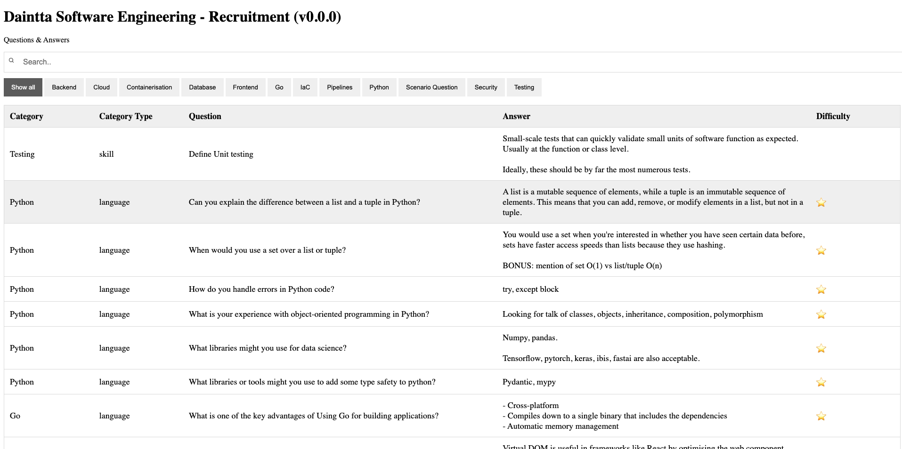

# Recruitment-Questions
A repository for deploying SWE recruitment Qs & As to a website.



## Updating Data
### Add New Questions
1. Go to `src/data/entries.csv`, and add a new entry

### Add New Categories
1. Go to `src/data/categories.csb`, and add a new entry

## Local Build
1. Setup venv
```
python3.12 -m venv venv
```
2. Enter venv
```
source venv/bin/activate
```
3. Install deps
```
make install
```
4. Run & Open
```
make ro
```

## Encrypt HTML
1. Install node and npm
2. Install staticrypt
```
npm install -g staticrypt
```
3. Create password
```
export STATICRYPT_PASSWORD=test-test-test-test
```
3. Encrypt file
```
make encrypt
```